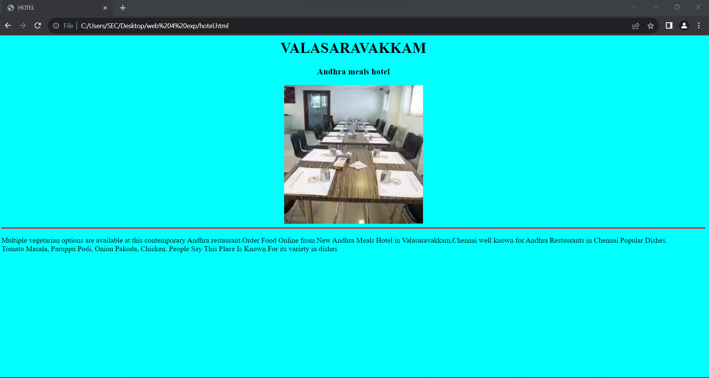
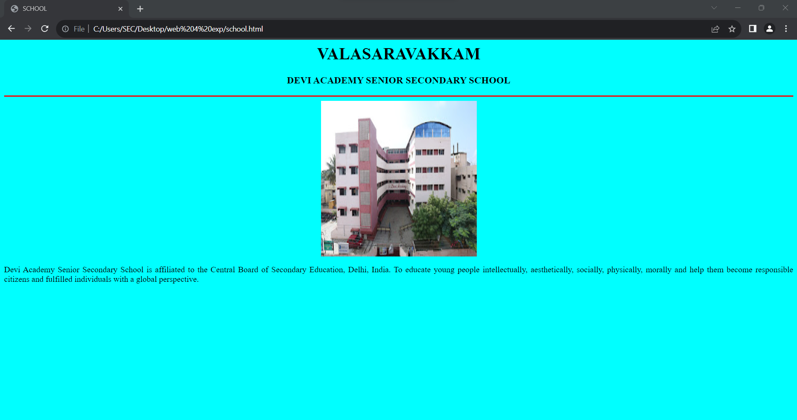
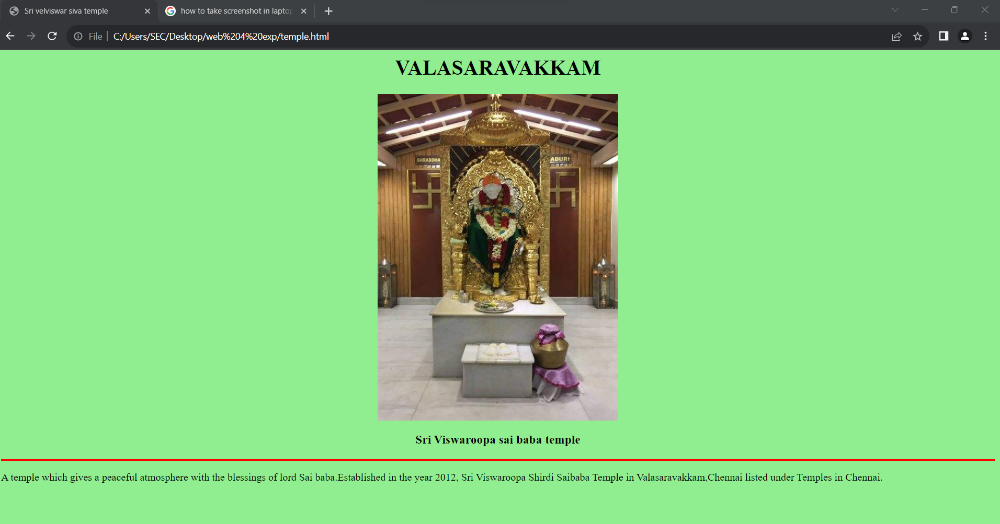
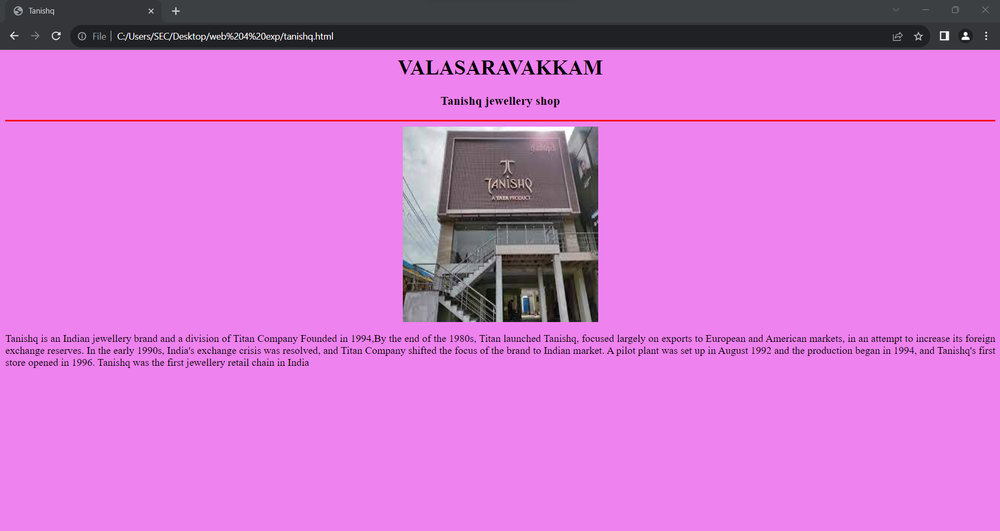
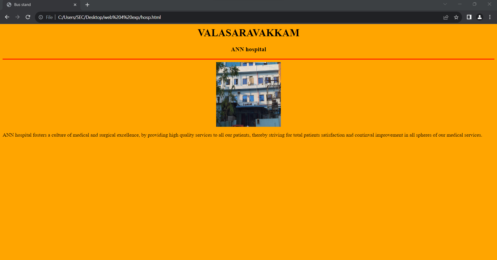

# Ex04 Places Around Me
## AIM
To develop a website to display details about the places around my house.

## DESIGN STEPS

### STEP 1
Create a Django admin interface.

### STEP 2
Download your city map from Google.

### STEP 3
Using ```<map>``` tag name the map.

### STEP 4
Create clickable regions in the image using ```<area>``` tag.

### STEP 5
Write HTML programs for all the regions identified.

### STEP 6
Execute the programs and publish them.

## CODE
```
trial.html
<!DOCTYPE html>
<html lang ="en">
<head>
<title> Image Map </title>
</head>
<body>
<h1 align="center">
<font color="red"><b>VALASARAVAKKAM</b></font>
</h1>
<h3 align="center">
<font color="blue"><b>Places Around Me</b></font>
</h3>
<center>

<map name="MyCity">
<area shape="circle" coords="250,40,60,60" href="temple.html" title="Sri Viswaroopa sai baba temple">
<area shape="circle" coords="1000,250,30" href="hosp.html" title="ANN Hospital">
<area shape="circle" coords="830,100,50" href="tanishq.html" title="TANISHQ JEWELLERY">
<area shape="circle" coords="170,180,60" href="school.html" title="DEVI ACADEMY SENIOR SECONDARY SCHOOL">
<area shape="circle" coords="1020,180,60" href="hotel.html" title="NEW ANDHRA MEALS NOTEL">

</map>
</center>
</body>
</html>

hotel.html
<html>
<head>
<title>HOTEL</title>
</head>
<body bgcolor="cyan">
<h1 align="center">VALASARAVAKKAM</h1>
<h3 align="center">Andhra meals hotel</h3>
<center>

<hr size="3" color="red">
<p align="justify">
    Multiple vegetarian options are available at this contemporary Andhra restaurant.Order Food Online from New Andhra Meals Hotel in Valasaravakkam,Chennai well known for Andhra Restaurants in Chennai  Popular Dishes. <brTomato Masala, Paruppu Podi, Onion Pakoda, Chicken. People Say This Place Is Known For its variety in dishes
</center>
</p>
</body>
</html>

tanishq.html
<html>
<head>
<title>Tanishq</title>
</head>
<body bgcolor="violet">
<h1 align="center">VALASARAVAKKAM</h1>
<h3 align="center">Tanishq jewellery shop</h3>
<hr size="3" color="red">
<center>

<p align="justify">
Tanishq is an Indian jewellery brand and a division of Titan Company Founded in 1994,By the end of the 1980s, Titan launched Tanishq, focused largely on exports to European and American markets, in an attempt to increase its foreign exchange reserves. In the early 1990s, India's exchange crisis was resolved, and Titan Company shifted the focus of the brand to Indian market. A pilot plant was set up in August 1992 and the production began in 1994, and Tanishq's first store opened in 1996. Tanishq was the first jewellery retail chain in India</p>
</center>

</body>
</html>

school.html 
<html>
<head>
<title>SCHOOL</title>
</head>
<body bgcolor="cyan">
<h1 align="center">VALASARAVAKKAM</h1>
<h3 align="center">DEVI ACADEMY SENIOR SECONDARY SCHOOL</h3>
<hr size="3" color="red">
<center>

<p align="justify">
    Devi Academy Senior Secondary School is affiliated to the Central Board of Secondary Education, Delhi, India.

    To educate young people intellectually, aesthetically, socially, physically, morally and help them become responsible citizens and fulfilled individuals with a global perspective.

</center>
</p>
</body>
</html>

tanishq.html 
<html>
<head>
<title>Tanishq</title>
</head>
<body bgcolor="violet">
<h1 align="center">VALASARAVAKKAM</h1>
<h3 align="center">Tanishq jewellery shop</h3>
<hr size="3" color="red">
<center>

<p align="justify">
Tanishq is an Indian jewellery brand and a division of Titan Company Founded in 1994,By the end of the 1980s, Titan launched Tanishq, focused largely on exports to European and American markets, in an attempt to increase its foreign exchange reserves. In the early 1990s, India's exchange crisis was resolved, and Titan Company shifted the focus of the brand to Indian market. A pilot plant was set up in August 1992 and the production began in 1994, and Tanishq's first store opened in 1996. Tanishq was the first jewellery retail chain in India</p>
</center>

</body>
</html>

hosp.html 
<html>
<head>
<title>Bus stand</title>
</head>
<body bgcolor="orange">
<h1 align="center">VALASARAVAKKAM</h1>
<h3 align="center">ANN hospital</h3>
<hr size="3" color="red">
<center>
    
<p align="justify">
    ANN hospital fosters a culture of medical and surgical excellence, by providing high quality services to all our patients, thereby striving for total patients satisfaction and continval improvement in all spheres of our medical services.

</p>
</center>
</body>
</html>

temple.html 
<html>
<head>
<title>Sri velviswar siva temple</title>
</head>
<center>
<body bgcolor="lightgreen">
    <h1 align="center">VALASARAVAKKAM</h1>
    
<h3 align="center" >Sri Viswaroopa sai baba temple</h3>
<hr size="3" color="red">
<p align="justify">
A temple which gives a peaceful atmosphere with the blessings of lord Sai baba.Established in the year 2012, Sri Viswaroopa Shirdi Saibaba Temple in Valasaravakkam,Chennai listed under Temples in Chennai.
</p>
</center>
</body>
</html>


```


## OUTPUT


 
 
 
 
 
 
## HTML VALIDATOR


## RESULT
The program for implementing image maps using HTML is executed successfully.
